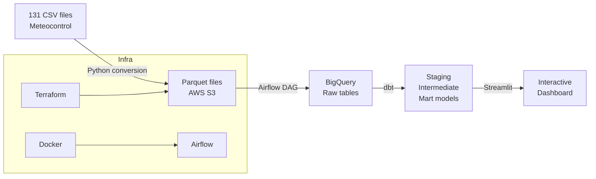
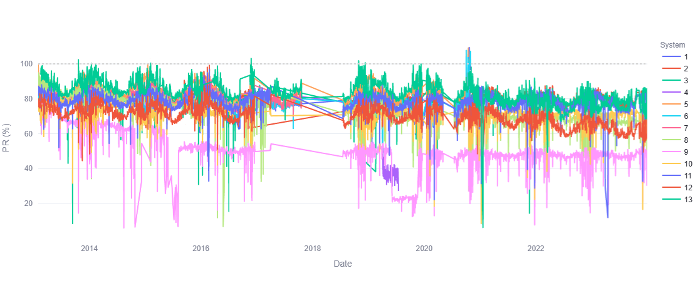
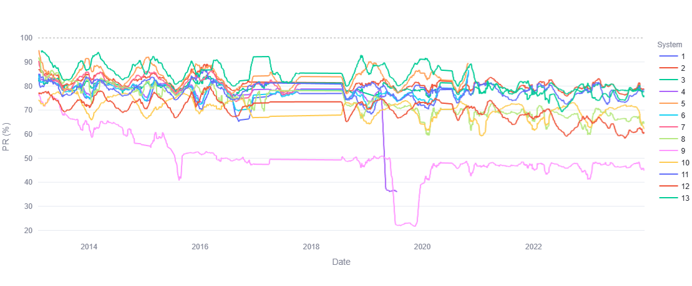
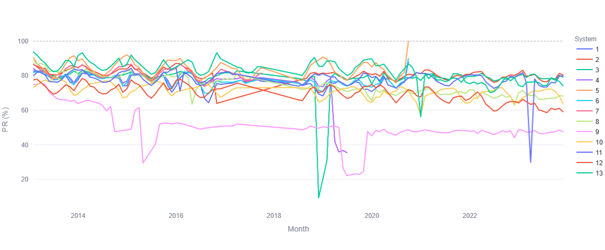
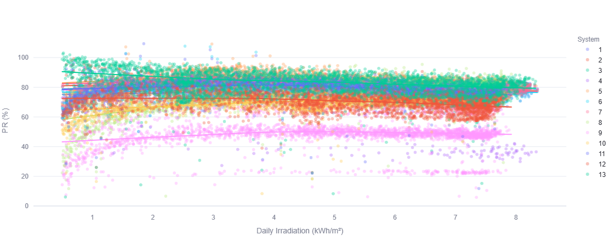
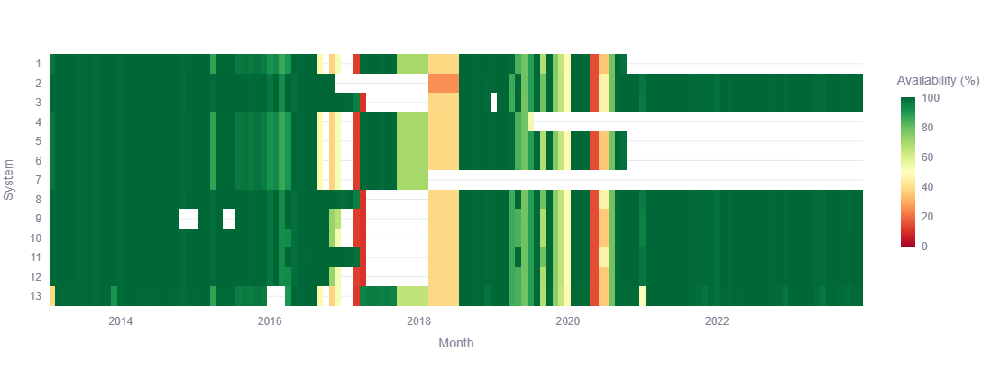

# Solar Performance Analytics Platform

> End-to-end data pipeline and analytics platform for 10 years of photovoltaic performance data — built with Python, dbt, BigQuery, and Streamlit.


---

## Overview

This project processes and analyses 10 years of solar irradiance and power output data from 13 photovoltaic systems (February 2013 – December 2023), originally stored in 131 monthly CSVs from a Meteocontrol monitoring system at UPM (Universidad Politécnica de Madrid).

The pipeline transforms raw sensor readings into ISO 61724-compliant Performance Ratio (PR) metrics, with a validated accuracy of **0.003% vs independent Python (pandas/numpy) calculations**.

It replaces a 500-line monolithic Python script with a fully modular, tested, and reproducible cloud pipeline — with an interactive Streamlit dashboard on top.

---

## Architecture



**Pipeline stages:**

1. **Ingestion** — 131 monthly CSVs converted to Parquet and uploaded to S3 via Python scripts (`src/`)
2. **Orchestration** — Airflow DAG (Dockerised) loads Parquet files from S3 into BigQuery raw tables
3. **Transformation** — dbt models clean, validate, and compute ISO 61724 metrics across 3 layers (staging → intermediate → mart)
4. **Visualisation** — Streamlit dashboard connected to BigQuery mart tables, with interactive filters and 4 chart types

---

## Dashboard

The Streamlit dashboard connects directly to BigQuery and provides interactive analysis of all 13 systems.

| Raw Daily PR Trends | 30-day Average PR Trends |
|---|---|
|  |  |

| Monthly Performance Comparison | PR vs Irradiance |
|---|---|
|  |  |

| Data Quality Heatmap |
|---|
|  |

**Charts:**
- Daily Performance Ratio trends — raw and 30-day smoothed, multi-system, date range selector
- Monthly performance comparison — bar chart, all 13 systems grouped by inclination
- PR vs irradiance scatter — all systems, highlights irradiance correction effect
- Data quality heatmap — system × month, colour = data availability %

**Filters:** system ID, date range, inclination group (5° / 10° / 30°)

---

## Key Results

| Metric | Value |
|---|---|
| Systems | 13 PV systems |
| Data span | 10 years (Feb 2013 – Dec 2023) |
| Raw readings | ~14.3 million rows |
| Complete daytime readings | ~4.4 million rows |
| Validation accuracy | **0.003% vs independent Python calculations** (3 independent checks) |
| Sensor failures handled | 9-month irradiance blackout, degraded pyranometer, DST logging bug, ambient temperature offset |

**Validation spot checks (pipeline vs pandas/numpy reference implementation):**

| System | Period | Pipeline PR | Reference PR | Delta |
|---|---|---|---|---|
| System 2 | Annual 2019 | 80.394% | 80.397% | −0.003% |
| System 8 | Annual 2016 | 76.025% | 76.029% | −0.004% |
| System 3 | Monthly Mar 2020 | 76.431% | 76.431% | 0.000% |

---

## dbt Model Structure

Models were developed in dbt Cloud IDE and can be imported into any dbt project targeting BigQuery.

```
models/
├── staging/
│   └── stg_solar_readings          # Cast, rename, filter 262 null rows
├── intermediate/                   # 14 models
│   ├── int_readings_unpivoted      # Wide→long (13-way UNION ALL) + DST fix
│   ├── int_readings_cleaned        # Manual overrides + range bounds
│   ├── int_irr_30deg_reconstructed # Cell irradiance from pyranometer (regression)
│   ├── int_irr_30deg_tnoc_derived  # Reverse-TNOC derivation (9-month blackout)
│   ├── int_readings_merged         # COALESCE: measured > regression > TNOC > donor
│   ├── int_ambient_temp_derived    # Reverse-TNOC ambient correction (2013–2016)
│   ├── int_sun_times               # Astronomical sunrise/sunset per inclination
│   ├── int_readings_daytime        # Sunrise→sunset filter
│   ├── int_readings_interpolated   # Linear interpolation for gaps ≤1hr
│   ├── int_readings_temp_estimated # Forward-TNOC for systems without temp sensors
│   ├── int_readings_complete       # Final pre-calculation table (6.66M rows)
│   ├── int_irr_reliability_flags   # Statistical QA: ratio, correlation, clear-sky
│   └── int_temp_reliability_flags  # Statistical QA: cross-system, TNOC, plausibility
└── marts/
    ├── mart_daily_performance      # ISO 61724 metrics per system per day
    ├── mart_monthly_performance    # Monthly aggregation (ratios recalculated from sums)
    └── mart_annual_performance     # Annual aggregation (days-weighted)
```

**Seeds (7 files):** system metadata, interval definitions, manual overrides (68 rows), per-system bounds, astronomical sun times (4,017 rows), clear-sky envelope (11,958 rows), donor days stub.

---

## Technical Highlights

**Sensor failure handling** — The pipeline handles 9 categories of known sensor failures, including a 9-month complete irradiance blackout (Oct 2017 – Jul 2018) recovered via reverse-TNOC derivation, a degraded pyranometer nullified from Oct 2021, a DST logging bug affecting 3 systems in 2017, and a +5–6°C ambient temperature offset active from 2013 to 2016.

**ISO 61724 metrics** — Full implementation of reference yield (Yr), array yield (Ya), final yield (Yf), capture losses (Lc), BOS losses (LBOS), and Performance Ratio (PR), including temperature-corrected and irradiance-corrected PR variants.

**Data quality tracking** — Every output row carries provenance flags: `pct_reconstructed`, `pct_interpolated`, `pct_temp_estimated`, `pct_ambient_derived`. No silent data fabrication.

**Reproducibility** — All sensor overrides and bounds are in version-controlled seed CSV files. Any result is fully reproducible from raw CSVs.

---

## How to Run

### Prerequisites
- Docker Desktop
- Python 3.9+
- AWS credentials configured in `~/.aws/` (S3 access)
- GCP service account JSON with BigQuery access
- dbt Cloud account (models developed in dbt Cloud IDE)

### 1. Infrastructure
```bash
cd terraform/
terraform init
terraform apply
```

### 2. Data ingestion (CSV → S3)
```bash
pip install -r requirements.txt
python src/data_conversion.py      # CSV → Parquet
python src/upload_to_s3.py         # Parquet → S3
```

### 3. Airflow (S3 → BigQuery)
```bash
cd airflow/
docker compose up airflow-init     # First time only
docker compose up -d               # Start services
# Trigger solar_pipeline_dag in Airflow UI at localhost:8080
# docker compose down when done
```

**Pipeline DAG tasks:**

| Task | Description |
|------|-------------|
| `convert_csv_to_parquet` | Convert 131 monthly CSVs to Parquet |
| `verify_conversion` | Validate file count, columns, format, year range |
| `validate_quality` | Physical bounds checking (ISO + AEMET limits) |
| `upload_to_s3` | Upload to S3 raw bucket |
| `verify_s3_upload` | Validate upload count, bucket, region |

Tasks communicate via XCom. If any validation fails, downstream tasks are blocked — bad data never reaches S3.

### 4. dbt transformation

Models are managed in dbt Cloud IDE. Connect your BigQuery project, import the models from this repo, and run:

```
dbt seed    # Load reference data (7 seed files)
dbt run     # Build all models
dbt test    # Run schema + custom tests
```

### 5. Streamlit dashboard
```bash
cd dashboard/
pip install -r requirements.txt

# Set BigQuery credentials
export GOOGLE_APPLICATION_CREDENTIALS=/path/to/your/service_account.json

streamlit run app.py
```

---

## S3 Structure

```
solar-analytics-raw-scl-dev/
├── raw/
│   ├── monthly/                  # 131 monthly CSV files
│   │   └── year=YYYY/
│   │       └── month=MM/
│   └── auxiliary/
│       ├── csv/
│       └── xlsx/
└── staging/
    └── monthly/                  # Cleaned Parquet files
        └── year=YYYY/
            └── month=MM/
```

---

## Project Structure

```
solar-analytics/
├── terraform/          # AWS infrastructure (S3 bucket, IAM)
├── src/                # Python ingestion scripts
│   ├── data_conversion.py
│   ├── verify_conversion.py
│   ├── upload_to_s3.py
│   ├── verify_s3_upload.py
│   └── validate_parquet.py
├── airflow/
│   ├── docker-compose.yaml
│   └── dags/solar_pipeline_dag.py
├── models/             # dbt models (staging + intermediate + marts)
├── seeds/              # dbt seed files (7 reference CSVs)
├── dashboard/
│   ├── app.py
│   ├── requirements.txt
│   └── screenshots/
├── requirements.txt
└── README.md
```

---

## What's Next

- **dbt Fundamentals certification** — in progress
- **Streamlit Cloud deployment** — for live demo without local setup
- **Databricks integration** — migrate heavy transformations to Spark for scale
- **Reliability flag review** — statistical QA flags ready for domain expert review

---

## Background

Built as a portfolio project during a career transition from Software Engineer (REE — Spanish TSO, 4 years) to Data Engineer. The original analysis was a 500-line Python script processing solar monitoring data from a UPM university research collaboration. This project rebuilds it as a production-grade pipeline using current data engineering tooling.

Domain: photovoltaic performance analysis, ISO 61724, Spanish transmission grid data.
