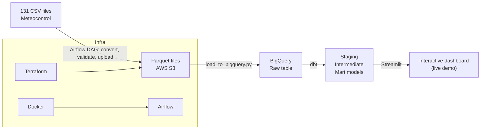
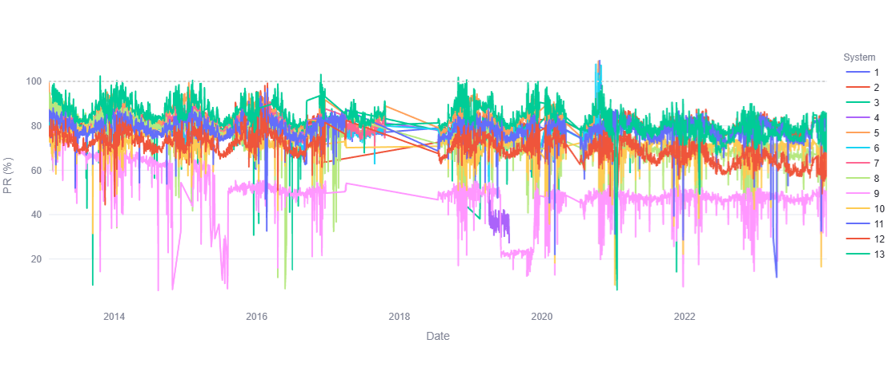
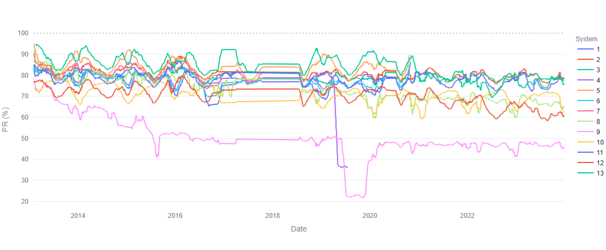
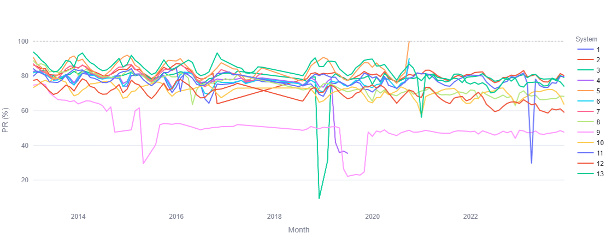
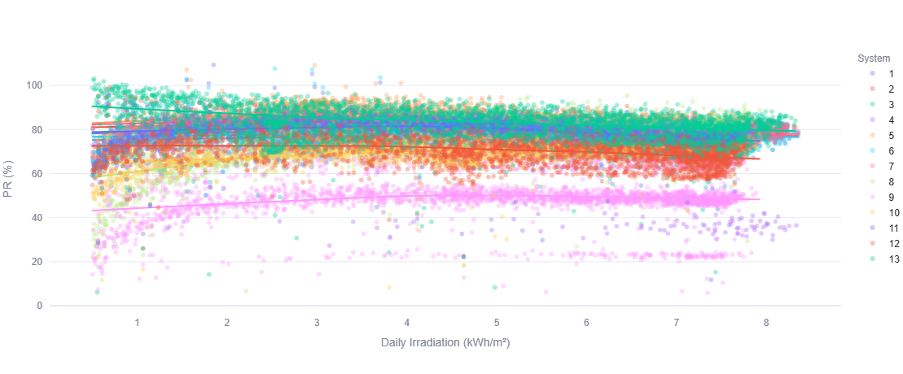
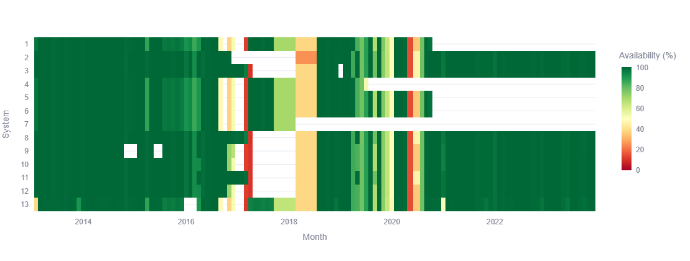

# Solar Performance Analytics Platform

> End-to-end data pipeline and analytics platform for 11 years (2013–2023) of photovoltaic performance data : built with Python, dbt, BigQuery, and Streamlit.

**Live demo:** [sergio-solar-analytics.streamlit.app](https://sergio-solar-analytics.streamlit.app/) : the dashboard below, querying the BigQuery mart tables, redeployed automatically from `main`.


[](https://sergio-solar-analytics.streamlit.app/)

---

## Overview

This project processes and analyses 11 years (2013–2023) of solar irradiance and power output data from 13 photovoltaic systems (February 2013 – December 2023), originally stored in 131 monthly CSVs from a Meteocontrol monitoring system at UPM (Universidad Politécnica de Madrid).

The pipeline transforms raw sensor readings into IEC 61724 Performance Ratio (PR) metrics, matching the original pandas/numpy analysis to **within 0.004 percentage points** on 3 spot checks.

It replaces a 500-line monolithic Python script with a fully modular, tested, and reproducible cloud pipeline, with an interactive Streamlit dashboard on top.

---

## Architecture


```mermaid
flowchart LR
    A["131 CSV files<br/>Meteocontrol"] -->|"Airflow DAG: convert, validate, upload"| B["Parquet files<br/>AWS S3"]
    B -->|load_to_bigquery.py| C["BigQuery<br/>Raw table"]
    C -->|dbt| D["Staging<br/>Intermediate<br/>Mart models"]
    D -->|Streamlit| E["Interactive dashboard<br/>(live demo)"]

    subgraph Infra
        F[Terraform] --> B
        G[Docker] --> H[Airflow]
    end
```

**Pipeline stages:**

1. **Ingestion** : an Airflow DAG (Dockerised) converts the 131 monthly CSVs to Parquet, validates them and uploads them to S3. Each step is also a standalone Python script in `src/`
2. **Load** : `src/load_to_bigquery.py` loads the Parquet files from S3 into a BigQuery raw table (one-off, safe to re-run)
3. **Transformation** : dbt models clean, validate, and compute IEC 61724 metrics across 3 layers (staging → intermediate → mart)
4. **Visualisation** : Streamlit dashboard connected to BigQuery mart tables, with interactive filters and 4 chart types

---

## Dashboard

The Streamlit dashboard connects directly to BigQuery and provides interactive analysis of all 13 systems. It is live at [sergio-solar-analytics.streamlit.app](https://sergio-solar-analytics.streamlit.app/): the deployed app reads the mart tables through a read-only service account, caches results for 6 hours and caps every query at 1 GiB scanned.

| Raw Daily PR Trends | 30-day Average PR Trends |
|---|---|
|  |  |

| Monthly Performance Comparison | PR vs Irradiance |
|---|---|
|  |  |

| Data Quality Heatmap |
|---|
|  |

**Charts:**
- Daily Performance Ratio trends : raw and 30-day smoothed, multi-system, date range selector
- Monthly performance comparison : monthly PR per system, all 13 systems on one chart
- PR vs daily irradiation scatter : all systems, with a LOWESS trend line per system
- Data quality heatmap : system × month, colour = data availability %

**Filters:** systems, date range, inclination group (5° / 10° / 30°)

---

## Key Results

| Metric | Value |
|---|---|
| Systems | 13 PV systems |
| Data span | 11 years (Feb 2013 – Dec 2023) |
| Raw readings | ~14.3 million rows |
| Complete daytime readings | ~4.4 million rows |
| Validation | **within 0.004 percentage points** of the original pandas/numpy analysis (3 spot checks) |
| Sensor failures handled | 9-month irradiance logging blackout, dead and degraded irradiance sensors, 2017 DST logging error, ambient temperature offset |

**Validation spot checks (pipeline vs pandas/numpy reference implementation):**

| System | Period | Pipeline PR | Reference PR | Delta |
|---|---|---|---|---|
| System 2 | Annual 2019 | 80.394% | 80.397% | −0.003% |
| System 8 | Annual 2016 | 76.025% | 76.029% | −0.004% |
| System 3 | Monthly Mar 2020 | 76.431% | 76.431% | 0.000% |

---

## dbt Model Structure

Models were developed in dbt Cloud IDE and can be imported into any dbt project targeting BigQuery.

```
models/
├── staging/
│   └── stg_solar_readings          # Cast, rename, filter 262 null rows
├── intermediate/                   # 13 models
│   ├── int_readings_unpivoted      # Wide→long (13-way UNION ALL) + DST fix
│   ├── int_readings_cleaned        # Manual overrides + range bounds
│   ├── int_irr_30deg_reconstructed # Cell irradiance from pyranometer (regression)
│   ├── int_irr_donor_substituted   # Donor-day fill for 5°/10° gaps (built, seed still empty)
│   ├── int_readings_merged         # COALESCE: measured > regression > donor
│   ├── int_ambient_temp_derived    # Reverse-TNOC ambient correction (2013–2016)
│   ├── int_sun_times               # Astronomical sunrise/sunset per inclination
│   ├── int_readings_daytime        # Sunrise→sunset filter
│   ├── int_readings_interpolated   # Linear interpolation for gaps ≤1hr
│   ├── int_readings_temp_estimated # Forward-TNOC for systems without temp sensors
│   ├── int_readings_complete       # Final pre-calculation table (6.66M rows)
│   ├── int_irr_reliability_flags   # Statistical QA: ratio, correlation, clear-sky
│   └── int_temp_reliability_flags  # Statistical QA: cross-system, TNOC, plausibility
└── marts/
    ├── mart_daily_performance      # IEC 61724 metrics per system per day
    ├── mart_monthly_performance    # Monthly aggregation (ratios recalculated from sums)
    └── mart_annual_performance     # Annual aggregation (days-weighted)
```

**Seeds (7 files):** system metadata, interval definitions, manual overrides (77 rows), per-system bounds, astronomical sun times (4,017 rows), clear-sky envelope (11,958 rows), donor days stub.

---

## Testing & CI

**dbt tests : 17 models, 69 test declarations.** Every layer carries schema tests: `models/schema.yml` (staging, 4 `not_null`), `models/intermediate/schema.yml` (13 models, `not_null` + `accepted_values` on enum-shaped columns like `system_id`, `inclination_deg`, `sun_method`), `models/marts/schema.yml` (3 models, `unique` composite-key tests + custom `dbt_utils.expression_is_true` SQL assertions, e.g. `e_ac_kwh >= 0`, `pr_pct <= 110`, `e_dc_kwh >= e_ac_kwh`).

**Python unit tests : `tests/unit/` (13 tests, pytest).** Covers the pure-logic and file-integrity paths of the ingestion scripts against synthetic Parquet fixtures. No AWS/GCP credentials or real dataset needed:
- `test_data_conversion.py` : filename-parsing regex (`parse_filename`)
- `test_validate_parquet.py` : physical-bounds config sanity + the file-count / schema-consistency / non-empty / out-of-bounds validation logic in `validate_parquet_quality`
- `test_verify_conversion.py` : row/column aggregation in `verify_all_parquet`

**CI : `.github/workflows/ci.yml`.** Runs on every push/PR to `main`:

| Job | Checks | Scope |
|---|---|---|
| `python-tests` | `pytest tests/unit -v` | The 13 tests above |
| `dbt-parse` | `dbt parse` | Project structure, Jinja/SQL syntax, `ref()`/`source()` resolution, schema YAML validity. **No warehouse connection** |
| `sqlfluff-lint` | dbt SQL style | Advisory, `continue-on-error: true`: does not gate the badge |

**Why CI stops at `dbt parse`:** this project's dbt models run on **dbt Cloud's free Developer plan**, not dbt Core CLI, so there is no CI-accessible BigQuery warehouse to run `dbt test`/`dbt build` against without provisioning one or committing a service-account key to a public portfolio repo. `dbt parse` is as far as credential-free CI can go: it validates that the entire project compiles (every model, every macro, every schema.yml) without touching the warehouse. The full `dbt test` suite above runs in the dbt Cloud IDE against the real data (see "How to Run" → dbt transformation, below).

---

## Data-Quality Findings

The quality checks were not only a final gate: they shaped the pipeline while it was being built.
During development and testing, the checks (per-system physical bounds, cross-system comparisons,
reliability flags) surfaced **five issues** across the code and the data. Most were in the data:
periods with missing or unreliable readings beyond the ones I had already identified in months of
reviewing the same data in dashboards. Each finding was fixed in the pipeline itself, as a code
change or as a dated, reasoned entry in `seeds/seed_manual_overrides.csv`, and the checks were
re-run until the outputs were clean. The override seed (77 dated entries today) is the versioned
record of those data-quality decisions, so the cleaning is reviewable rather than done by eye.

---

## Technical Highlights

**Sensor failure handling** : Known sensor failures are handled in the cleaning layer, each as a dated entry in the override seed or a dedicated model. They include a 9-month irradiance logging blackout (Oct 2017 – Jul 2018), excluded rather than filled; a dead 30° irradiance cell (Aug 2015 – Mar 2016), reconstructed from the pyranometer by linear regression; a degraded pyranometer nullified from Oct 2021; a 2017 DST logging error corrected on 10 of the 13 systems (the other 3 loggers applied DST correctly); and a +5–6°C ambient temperature offset from 2013 to 2016, corrected by reverse-TNOC derivation.

**IEC 61724 metrics** : Full implementation of reference yield (Yr), array yield (Ya), final yield (Yf), capture losses (Lc), BOS losses (LBOS), and Performance Ratio (PR), including temperature-corrected and irradiance-corrected PR variants.

**Data quality tracking** : Every output row carries provenance flags: `pct_reconstructed`, `pct_interpolated`, `pct_temp_estimated`, `pct_ambient_derived`. No silent data fabrication.

**Reproducibility** : All sensor overrides and bounds are in version-controlled seed CSV files, and the 131 monthly Parquet files are committed under `data/staging/`, so every dbt result can be rebuilt from them.

---

## How to Run

**Quickest look:** the [live demo](https://sergio-solar-analytics.streamlit.app/), no setup needed.

**Quick check, no cloud credentials:** the unit tests run on synthetic fixtures.
```bash
pip install -r requirements.txt pytest
pytest tests/unit -v
```

**Full pipeline** (needs your own AWS and GCP accounts):

### Prerequisites
- Docker Desktop
- Python 3.9+
- AWS credentials configured in `~/.aws/` (S3 access)
- GCP service account JSON with BigQuery access
- dbt Cloud account (models developed in dbt Cloud IDE)

### 1. Infrastructure
```bash
cd terraform/
terraform init
terraform apply
```

### 2. Data ingestion without Airflow (CSV → S3)
```bash
pip install -r requirements.txt
python src/data_conversion.py      # CSV → Parquet
python src/upload_to_s3.py         # Parquet → S3
```

### 3. Or with Airflow (CSV → S3)
```bash
cd airflow/
docker compose up airflow-init     # First time only
docker compose up -d               # Start services
# Trigger solar_pipeline_dag in Airflow UI at localhost:8080
# docker compose down when done
```

**Pipeline DAG tasks:**

| Task | Description |
|------|-------------|
| `convert_csv_to_parquet` | Convert 131 monthly CSVs to Parquet |
| `verify_conversion` | Validate file count, columns, format, year range |
| `validate_quality` | Physical bounds checking (ISO + AEMET limits) |
| `upload_to_s3` | Upload to S3 raw bucket |
| `verify_s3_upload` | Validate upload count, bucket, region |

Tasks communicate via XCom. If any validation fails, downstream tasks are blocked, so bad data never reaches S3.

### 4. Load to BigQuery (S3 → BigQuery)
```bash
python src/load_to_bigquery.py     # set GCP_KEY_PATH / GCP_PROJECT at the top of the script first
```

### 5. dbt transformation

Models are managed in dbt Cloud IDE. Connect your BigQuery project, import the models from this repo, and run:

```
dbt seed    # Load reference data (7 seed files)
dbt run     # Build all models
dbt test    # Run schema + custom tests
```

### 6. Streamlit dashboard
```bash
cd dashboard/
pip install -r requirements.txt

# Local run uses your Google Application Default Credentials
gcloud auth application-default login
# (or: export GOOGLE_APPLICATION_CREDENTIALS=/path/to/your/service_account.json)

# Point it at your own project/dataset in .streamlit/secrets.toml:
#   [bigquery]
#   project_id = "your-project"
#   dataset    = "your_dataset"

streamlit run app.py
```

---

## S3 Structure

```
solar-analytics-raw-scl-dev/
├── raw/
│   ├── monthly/                  # 131 monthly CSV files
│   │   └── year=YYYY/
│   │       └── month=MM/
│   └── auxiliary/
│       ├── csv/
│       └── xlsx/
└── staging/
    └── monthly/                  # Cleaned Parquet files
        └── year=YYYY/
            └── month=MM/
```

---

## Project Structure

```
solar-analytics/
├── .github/workflows/
│   └── ci.yml           # pytest + dbt parse + sqlfluff lint (see Testing & CI)
├── terraform/          # AWS infrastructure (S3 bucket, IAM)
├── src/                # Python ingestion + seed-generation scripts
│   ├── data_conversion.py
│   ├── verify_conversion.py
│   ├── validate_parquet.py
│   ├── upload_to_s3.py
│   ├── verify_s3_upload.py
│   ├── load_to_bigquery.py
│   ├── generate_astronomical_suntimes.py
│   └── generate_clear_sky_envelope.py
├── data/staging/       # 131 monthly Parquet files
├── docs/               # data dictionary, original project notes
├── tests/
│   ├── unit/            # pytest: src/ script logic (synthetic fixtures)
│   └── *.sql            # dbt singular tests (none yet; directory reserved)
├── airflow/
│   ├── docker-compose.yaml
│   └── dags/solar_pipeline_dag.py
├── models/             # dbt models (staging + intermediate + marts) + schema.yml tests
├── seeds/              # dbt seed files (7 reference CSVs)
├── dashboard/
│   ├── app.py
│   ├── requirements.txt
│   └── screenshots/
├── conftest.py          # anchors pytest rootdir so tests/ can `from src... import`
├── .sqlfluff             # dbt SQL lint config (advisory CI job)
├── requirements.txt
└── README.md
```

---

## What's Next

- **dbt build on merge** : run `dbt build` (models + 69 tests) against BigQuery from GitHub Actions when a PR merges to `main`, and point the live dashboard at the dataset it builds
- **Donor-day substitution** : the model is built, but its seed is still empty, so 5°/10° irradiance gaps stay NULL for now
- **Reliability flag review** : statistical QA flags ready for domain expert review
- **Databricks** : port the transformations to Spark to compare with the dbt/BigQuery version

---

## Background

Built as a portfolio project during my move into data engineering, after 4 years as a Grid Operations & Data Specialist at REE (Spain's national grid operator). The original analysis was paid research work at UPM: a 500-line Python script processing solar monitoring data from real PV plants. This project rebuilds it as a modular, tested cloud pipeline using current data engineering tooling.

Domain: photovoltaic performance analysis, IEC 61724.
